# Frontend Mentor - Typing Speed Test solution

This is a solution to the [Typing Speed Test challenge on Frontend Mentor](https://www.frontendmentor.io/challenges/typing-speed-test). Frontend Mentor challenges help you improve your coding skills by building realistic projects.

## Table of contents

- [Frontend Mentor - Typing Speed Test solution](#frontend-mentor---typing-speed-test-solution)
  - [Table of contents](#table-of-contents)
  - [Overview](#overview)
    - [The challenge](#the-challenge)
    - [Screenshot](#screenshot)
      - [Home - Not started](#home---not-started)
      - [Home - Started](#home---started)
      - [Result](#result)
      - [Result - First test](#result---first-test)
      - [Result - High Score](#result---high-score)
    - [Links](#links)
  - [My process](#my-process)
    - [Built with](#built-with)
    - [What I learned](#what-i-learned)
      - [Setup custom style of tailwind](#setup-custom-style-of-tailwind)
      - [Setup persist state (get data from localStorage to Redux)](#setup-persist-state-get-data-from-localstorage-to-redux)
  - [Author](#author)

**Note: Delete this note and update the table of contents based on what sections you keep.**

## Overview

### The challenge

Users should be able to:

- View the optimal layout for the interface depending on their device's screen size
- See hover and focus states for all interactive elements on the page

### Screenshot

#### Home - Not started

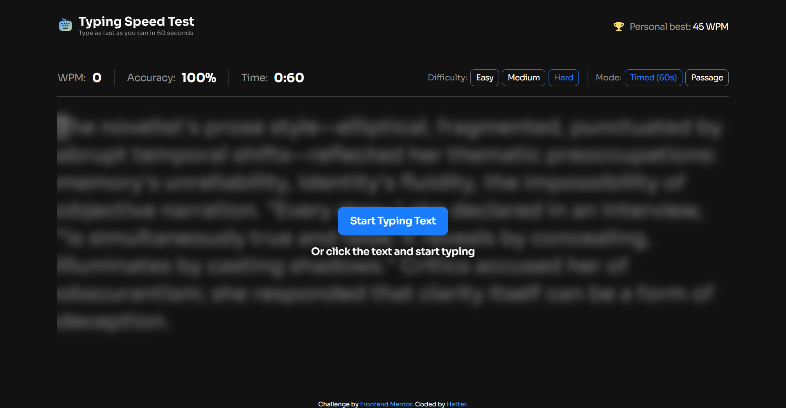
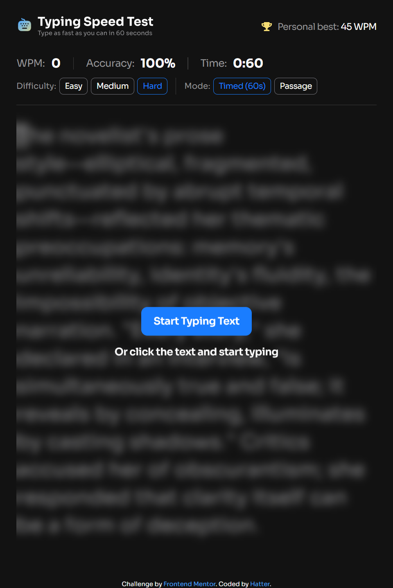
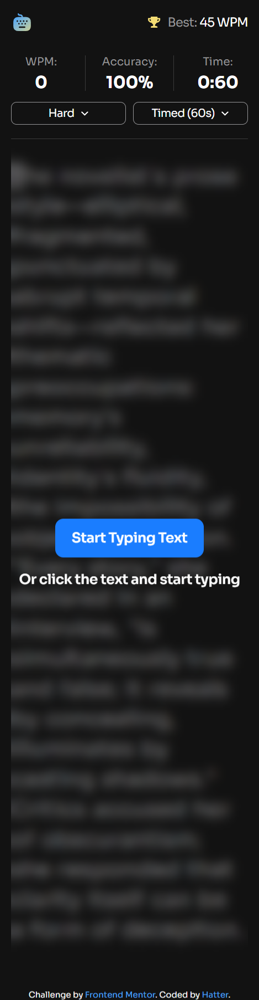

#### Home - Started

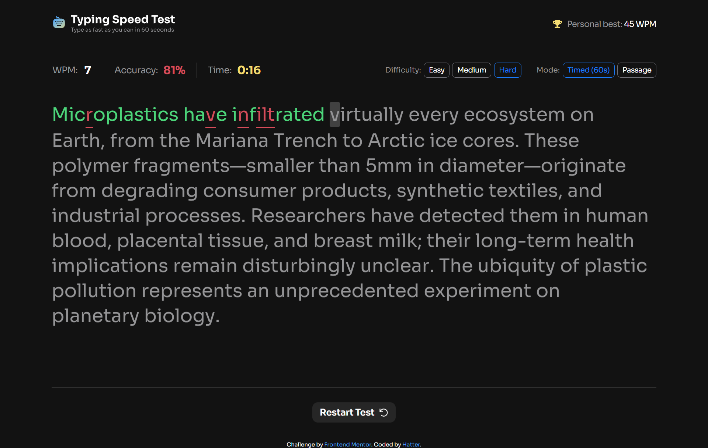
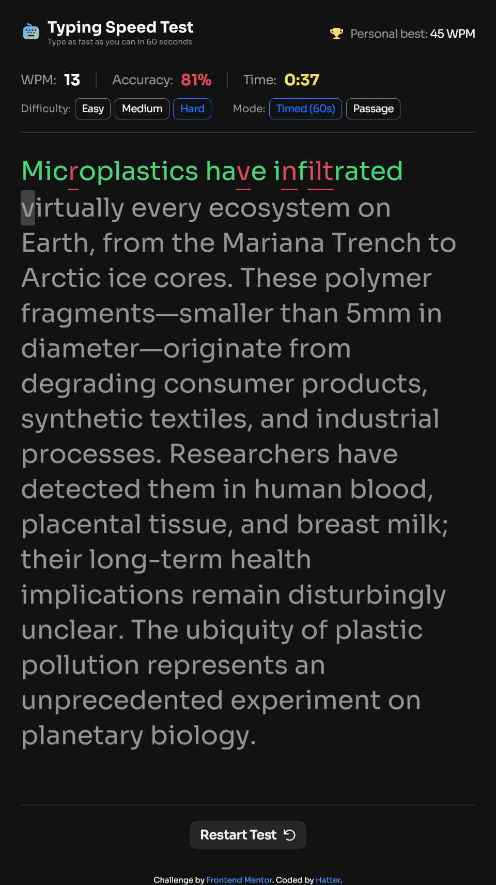
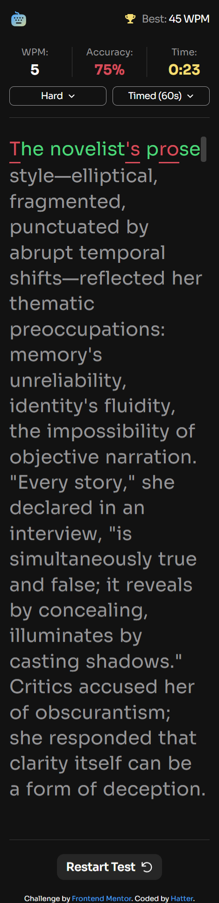

#### Result

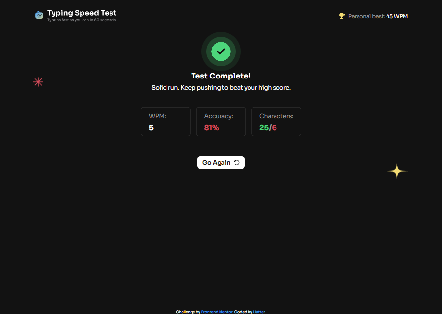
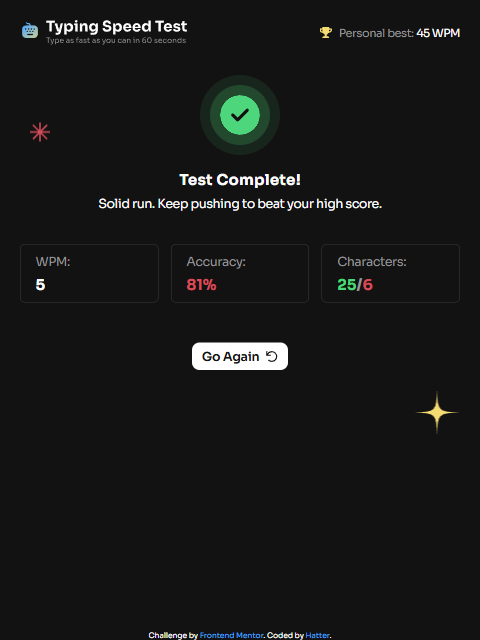
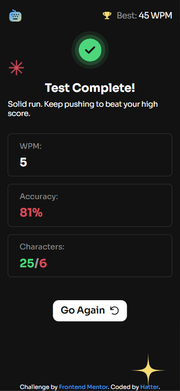

#### Result - First test

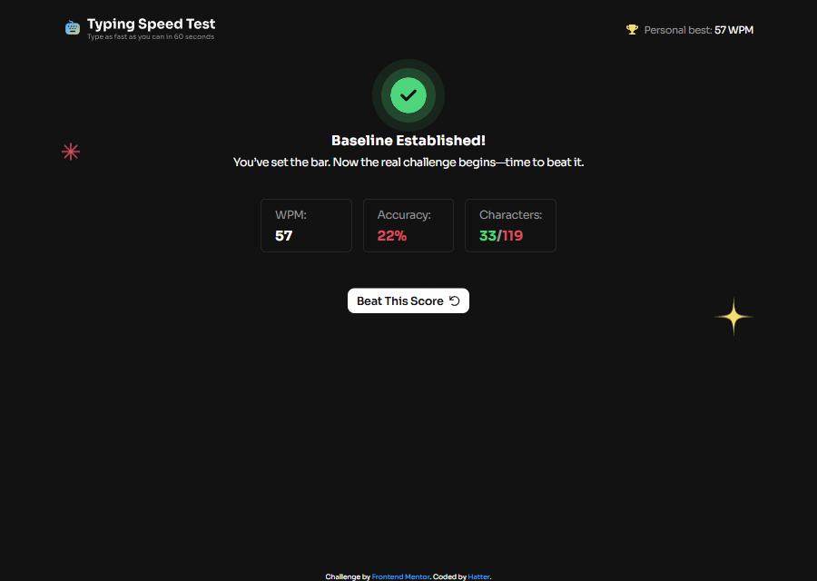
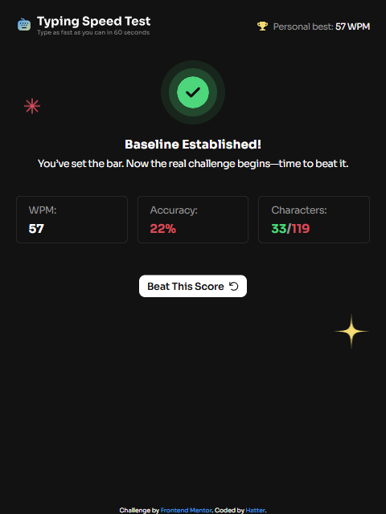
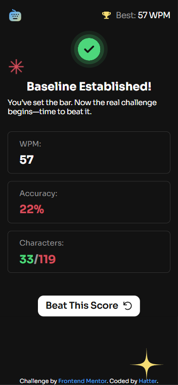

#### Result - High Score

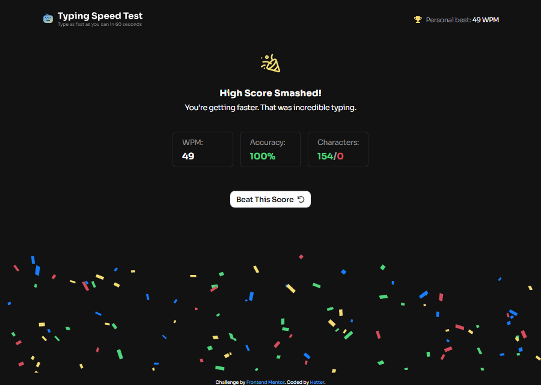
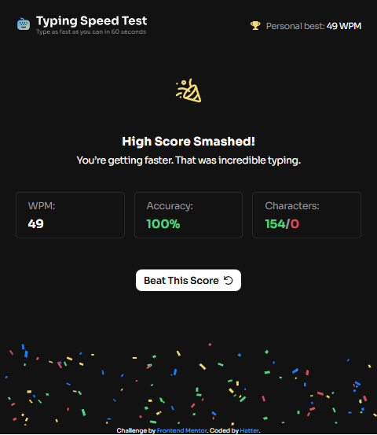
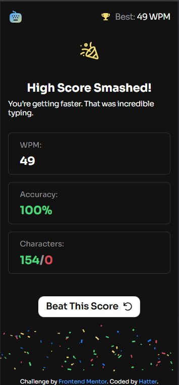

### Links

- Solution URL: [Hatter-s/typing-speed-test](https://github.com/Hatter-s/typing-speed-test)
- Live Site URL: [Here](https://typing-speed-test-hatter.netlify.app)

## My process

### Built with

- Typescript - main language
- [React](https://reactjs.org/) - JS library
- [Redux](https://redux.js.org/) - State management
- [React router](https://reactrouter.com/) - Router for SPA
- [Tailwind CSS](https://tailwindcss.com/) - CSS framework

### What I learned

Use this section to recap over some of your major learnings while working through this project. Writing these out and providing code samples of areas you want to highlight is a great way to reinforce your own knowledge.

To see how you can add code snippets, see below:

#### Setup custom style of tailwind

```css
@theme {
  --font-sans: 'Sora', 'sans-serif';

  --color-neutral-900: hsl(0, 0%, 7%);
  --color-neutral-800: hsl(0, 0%, 15%);
  --color-neutral-700: hsl(0, 0%, 23%);
  --color-neutral-500: hsl(240, 3%, 46%);
  --color-neutral-400: hsl(240, 1%, 59%);
  --color-neutral-0: hsl(0, 0%, 100%);

  ...

  --radius-12: 12px;
  --radius-16: 16px;
  --radius-20: 20px;
  --radius-24: 24px;
  --radius-full: 9999px;
}

@utility cus-text-1 {
  @apply text-2xl md:text-[40];
  @apply tracking-[0,32px] md:tracking-[0.4px];
  @apply leading-[1.2] md:leading-[1.36];
  @apply font-bold;
}

@utility cus-text-1-regular {
  @apply text-[32px] md:text-[40px];
  @apply tracking-[0,4px];
  @apply leading-[1.36];
}

...
@layer components {
  .config-warper {
    @apply flex flex-row flex-nowrap items-center gap-75;

    .title {
      @apply text-neutral-400;
    }
  }

  ...

  .result-info-container {
    @apply flex w-full flex-col items-stretch gap-y-200 pb-200;
    ...
    .result-info-item {
      @apply rounded-8 flex w-full flex-col gap-150 border border-neutral-700 px-300 py-200 lg:w-40;

      .title {
        @apply cus-text-3 text-neutral-400;
      }

      .content {
        @apply cus-text-2;
      }
    }
  }
}

```

#### Setup persist state (get data from localStorage to Redux)

- utils/localStorage.ts

```ts
export const loadState = <T>(key: string): T | undefined => {
  try {
    const valueString = localStorage.getItem(key);
    return valueString ? (JSON.parse(valueString) as T) : undefined;
  } catch {
    return undefined;
  }
};

export const saveState = (key: string, state: unknown) => {
  try {
    localStorage.setItem(key, JSON.stringify(state));
  } catch (error) {
    console.error(error);
  }
};
```

- store/index.ts

```ts
  ...
  const persistedHighestWPM = loadState<number>('highestWPM');
  const persistedConfig = loadState<ConfigData>('config');
  ...
  export store = configureStore({
    ...
    preloadedState: {
      config:
        persistedConfig !== undefined && persistedConfig !== null
          ? { ...initConfig, data: persistedConfig }
          : initConfig,
      info:
        persistedHighestWPM !== undefined && persistedHighestWPM !== null
          ? { ...initInfo, data: { ...initInfo.data, highestWPM: persistedHighestWPM } }
          : initInfo,
    },
  });

  store.subscribe(() => {
    const state = store.getState();
    saveState('highestWPM', state.info.data?.highestWPM);
    saveState('config', state.config.data);
  )};
  ...
```

## Author

- Frontend Mentor - [@Hatter-s](https://www.frontendmentor.io/profile/Hatter-s)
- Github - [@Hatter-s](https://github.com/Hatter-s)
